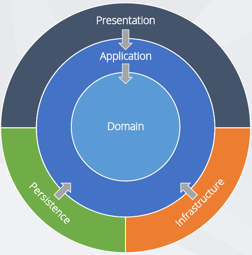

# BuildMonitor (Work in Progress!)

> Dashboard to display the status of your builds from your build server (e.g. TeamCity).

## Installation

Set the following **environment variables** to specify the connection to your build server:
- `BUILDMONITOR__HOST`, e.g. `server.example.com:8080`
- `BUILDMONITOR__USERNAME`, e.g. `myuser`
- `BUILDMONITOR__PASSWORD`, e.g. `mypassword`

## Technology highlights

- **ASP.NET Core 2.1** backend targeting the full .NET Framework (required by a referenced 3rd-party component).
  - **Dependency injection** for clear dependencies and testability + **unit tests**.
    - Random **test data generation** with [Bogus](https://github.com/bchavez/Bogus).
  - **Static code analysis** with Microsoft Code Analysis (aka. FxCop).
  - Enforced **coding standards** with [StyleCop](https://github.com/StyleCop/StyleCop).
  - Configuration read from **environment variables** and JSON. (Read more: [The Twelve-Factor App: III. Config](https://12factor.net/config))
    - Automatic **configuration reloading** with the [Options pattern](https://docs.microsoft.com/en-us/aspnet/core/fundamentals/configuration/options?view=aspnetcore-2.1).
    - Configuration value **validation** with data annotations.
  - All assemblies are **strong-named**.
    - **Signing third-party open-source assemblies** with [StrongNamer](https://github.com/dsplaisted/strongnamer).
  - Enforcing **HTTPS and [HSTS](https://en.wikipedia.org/wiki/HTTP_Strict_Transport_Security)** by default.
  - **Moment-like date formatting** with [Humanizer](https://github.com/Humanizr/Humanizer).
  - Accessing the **TeamCity REST API** with [TeamCitySharp](https://github.com/mavezeau/TeamCitySharp).
    - **Caching** API responses **in-memory** with [IMemoryCache](https://docs.microsoft.com/en-us/aspnet/core/performance/caching/memory?view=aspnetcore-2.1) + fixing the [multiple factory call issue](https://tpodolak.com/blog/2017/12/13/asp-net-core-memorycache-getorcreate-calls-factory-method-multiple-times/) tested with unit test.
- **Angular 6** Single Page Application frontend implemented in **TypeScript**.
  - **Server-side** rendering.
  - **Static code analysis** with [TSLint](https://palantir.github.io/tslint/).
  - Customized **[Angular Material](https://material.angular.io/)** design implemented in [SCSS](http://sass-lang.com/), with the layout based on [cards](https://material.angular.io/components/card/overview).
  - Polling the backend with [RxJS Observables](http://reactivex.io/rxjs/class/es6/Observable.js~Observable.html).
  - Enforced coding standards with `.editorconfig`.
  - Human-friendly date formatting with [Moment](https://momentjs.com/) pipe.
- **Continuous Integration (CI)** with Azure DevOps.
  - Build pipeline implemented in `azure-pipelines.yml`.
    - Build includes both backend and frontend unit tests.
    - Build includes static code analysis.
  - Release pipeline to **Azure AppService**.

## Architecture

This solution follows the **Clean Architecture** recommended for ASP.NET Core applications. Read more:

- [Steve Smith: Architect Modern Web Applications with ASP.NET Core and Azure - free eBook](https://docs.microsoft.com/en-us/dotnet/standard/modern-web-apps-azure-architecture/)
- [Jason Taylor: Clean Architecture with ASP.NET Core 2.1 - conference presentation](https://www.youtube.com/watch?v=_lwCVE_XgqI)

The layers are implemented in separate projects to ensure correct separation of concerns and clear dependencies, even if this is a basic application and everything could be implemented in a single project, which would speed up the build process.

## Got feedback?

Your feedback is more than welcome, please send your suggestions, feature requests or bug reports as [Github issues](https://github.com/balassy/BuildMonitor/issues).

## Contributing guidelines

Contributions of all kinds are welcome, please feel free to send Pull Requests. As they are requirements of successful build all code analyzers and tests MUST pass, and also please make sure you have a reasonable code coverage for new code.

Thanks for your help in making this project better!

## Acknowledgements

Thanks to [Jason Taylor](https://www.youtube.com/watch?v=_lwCVE_XgqI) for the Clean Architecture diagram.

## About the author

This project is created and maintaned by [György Balássy](https://linkedin.com/in/balassy).